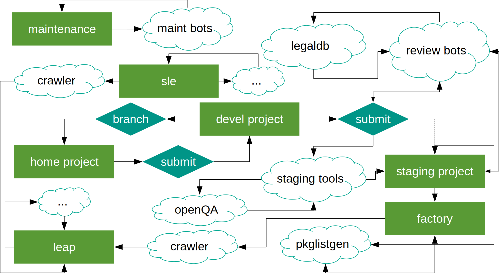

# openSUSE-release-tools

Everything denoted with a cloud is largely in this repository while the rest is the [open-build-service (OBS)](https://github.com/openSUSE/open-build-service).

## Installation

For non-development usage just install the package.

    zypper in openSUSE-release-tools

Many sub-packages are provided which can be found either by searching or [looking on the build service](https://build.opensuse.org/package/binaries/openSUSE:Tools/openSUSE-release-tools/openSUSE_Factory).

    zypper se openSUSE-release-tools osc-plugin

If CI builds are needed add the [appropriate `openSUSE:Tools` repository](https://software.opensuse.org//download.html?project=openSUSE%3ATools&package=openSUSE-release-tools).

## Usage

All tools provide help documentation accessible via `--help`.

For `osc` plugins include the plugin name after `osc` like the following.

    osc staging --help

For other tools execute the tool directly.

    osrt-repo-checker --help

See the [docs](/docs) directory or a specific tool directory for specific tool documentation outside of `--help`. The [wiki](/wiki) also contains some additional documentation.

## Development

    git clone https://github.com/openSUSE/openSUSE-release-tools.git

If working on an `osc` plugin create symlinks for the plugin and `osclib` in either `~/.osc-plugins` or `/usr/lib/osc-plugins`. For example to install the _staging_ plugin do the following.

    ln -sr ./osc-staging.py ./osclib ~/.osc-plugins

A containerized OBS can be started via one command. The default credentials are `Admin` and `opensuse` on [0.0.0.0:3000](http://0.0.0.0:3000).

    ./dist/ci/docker-compose-obs

An `osc` alias is automatically configured as `local`.

    osc -A local api /about

Some tests will attempt to run against the local OBS, but not all.

    nosetests
