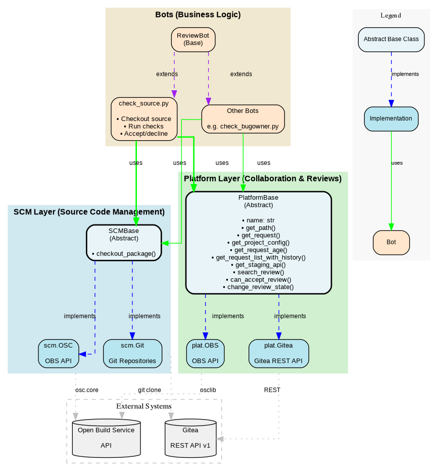

# Release Bot Framework - Documentation

## Overview

This document describes the public methods of the SCMBase and PlatformBase classes and their implementations. These base classes provide abstractions that allow bots (like check_source.py, ReviewBot.py, etc.) to interact with different source code management systems and collaboration platforms in a consistent way. The implementations are available in scm/ and plat/ sub-directories in [openSUSE-release-tools](https://github.com/openSUSE/openSUSE-release-tools) .

Main motivations:

1. Bots portability - all platforms expose the same core methods, making bots portable. A bot written for OBS can work with Gitea by simply changing the platform initialization.
2. Bots shall use the abstractions rather than direct API calls to remain portable across different platforms (Open Build Service - OBS, Gitea, etc.)
3. Separation of concerns
    * SCM Layer: Handles source code retrieval and checkout
    * Platform Layer: Handles collaboration features (requests, reviews, comments)
    * Bots: Implement business logic using both layers

## Architecture Diagram

The following diagram illustrates the relationships between the SCM layer, Platform layer, bots, and external systems:



You may wonder why is SCM Layer kept separate from Platform Layer in this architecture. This more for future cases when different platform interface (e.g. Gitea Actions) are using the same SCM Layer (e.g. Gitea) interfaces.


## SCM Layer (Source Code Management)

The SCM (Source Code Management) layer provides an abstraction for retrieving and checking out source code from different version control systems. This is implemented in scm/base.py.

### Base Class: SCMBase
#### Abstract Properties:

    name → str - Get the name of the SCM system

#### Abstract Methods (must be implemented by children):


    checkout_package(target_project: str, target_package: str, pathname, **kwargs) - Checkout a package to local filesystem
        Parameters:
            target_project: Project name/path
            target_package: Package name
            pathname: Local directory path to checkout into
            **kwargs: Additional options like revision
        Returns: Result of checkout operation

### Implementations:
1. scm.OSC - Open Build Service

    * Constructor: OSC(apiurl: str)
    * Property: name → returns "OSC"
    * Interacts with OBS API using osc.core library
    * Removes .osc directory after checkout
    * Used for traditional OBS workflows

2. scm.Git - Git repositories

    * Constructor: Git(logger, base_url)
    * Property: name → returns "GIT"
    * Clones Git repositories from {base_url}/{project}/{package}.git
    * Supports revision keyword argument for checking out specific commits
    * Removes .github, .gitea, .git directories after checkout
    * Used for Git-based package repositories

## Platform Layer (Collaboration & Reviews)

The Platform layer provides an abstraction for interacting with different collaboration platforms (OBS, Gitea, etc.) for managing requests, reviews, and projects. This is implemented in plat/base.py.

### Base Class: PlatformBase
#### Abstract Properties:

    name → str - Get the name of the platform

#### Abstract Methods (must be implemented by children):

    get_path(*_args) - Issue a GET request to a specific path from the repository
        Returns: File handle or response object

    get_request(request_id, with_full_history=False) - Retrieve a request by ID
        Parameters:
            request_id: Platform-specific request identifier
            with_full_history: Whether to include full history/comments
        Returns: Request object with actions, reviews, metadata

    get_project_config(project) - Get project configuration
        Parameters:
            project: Project name/identifier
        Returns: Config object with project settings

    get_request_age(request) - Get the age of a request
        Parameters:
            request: Request object
        Returns: timedelta or similar age representation

    get_request_list_with_history(project='', package='', req_who='', req_state=('new', 'review', 'declined'), req_type=None, exclude_target_projects=[]) - Get filtered list of requests with full history
        Parameters:
            project: Filter by target project
            package: Filter by target package
            req_who: Filter by request creator
            req_state: Tuple of states to include (e.g., 'new', 'review', 'declined')
            req_type: Filter by request type
            exclude_target_projects: List of projects to exclude
        Returns: List/generator of Request objects

    get_staging_api(project) - Get staging API for the project
        Parameters:
            project: Project name
        Returns: StagingAPI instance for managing staging workflows

    search_review(**kwargs) - Search review requests according to criteria
        Common kwargs:
            review_user: Filter by reviewer username
            review_group: Filter by reviewer group
        Returns: List/generator of Request objects

    can_accept_review(req, **kwargs) - Check whether it's possible to accept review for a request
        Parameters:
            req: Request object
            **kwargs: Platform-specific options
        Returns: Boolean indicating if review can be accepted

    change_review_state(req, newstate, message, **kwargs) - Change review state for a request
        Parameters:
            req: Request object
            newstate: New state ('accepted', 'declined', etc.)
            message: Review comment/message
            **kwargs: Platform-specific options like by_user, by_group
        Returns: Result of state change operation

#### Implementations:
1. plat.OBS - Open Build Service

    * Constructor: OBS(apiurl)
    * Property: name → returns "OBS"
    * Additional Property: comment_api - CommentAPI instance for * managing comments
    * Uses osc.core and osclib for OBS API interactions
    * Integrates with osclib.stagingapi.StagingAPI for staging workflows
    * Helper method: _has_open_review_by(root, by_what, reviewer) - * * Check for open reviews
    * Works with OBS request model (submit requests, maintenance requests, etc.)

2. plat.Gitea - Gitea platform

    * Constructor: Gitea(logger, url)
    * Property: name → returns "GITEA"
    * Additional Properties:
        * comment_api - CommentAPI instance for managing PR comments
        * api - Internal API wrapper for REST calls
    * Request ID format: {owner}:{repo}:{pr_id} (e.g., "opensuse:factory:123")
    * Uses Gitea REST API v1
    * Requires GITEA_ACCESS_TOKEN environment variable
    * Treats pull requests as review requests
    * Key Gitea-specific classes:
        * Request - Custom request structure with parse_request_id() and construct_request_id() methods
        * CommentAPI - Comment management with bot markers for tracking bot comments
        * StagingAPI - Staging operations (partial implementation)

## Running a bot locally for testing purpose

  The framework itself requires various dependencies from pip. Therefore, it is recommended to setup a virtual env for local development purpose:

```shell
$ python3 -mvenv .venv
$ . .venv/bin/activate
$ pip install -r requirements.txt
```

Then you can run the bot as a python script:

```shell
$ python my_bot.py -A <obs api url> --user <obs user> ... review
```

When running against OBS, the framework by default pulls user credentials from osc config. You can also start a local containerized OBS interface and run tests against that instance. The [openSUSE-release-tools](https://github.com/openSUSE/openSUSE-release-tools) README page does a pretty good job explaining the setup, and same setup also works in our case.


When running against Gitea, you need to use command line flags to make ReviewBot initialize the Git & Gitea implementation. Gitea uses API token for authorization, which needs to be passed to the framework with GITEA_ACCESS_TOKEN  environment variable:

```shell
$ export GITEA_ACCESS_TOKEN=<token>
$ python my_bot.py --scm git --platform gitea --git-base-url <checkout base url> --gitea-url <gitea url> review
```

e.g. When running against src.suse.de:

```shell
$ export GITEA_ACCESS_TOKEN=<token>
$ python my_bot.py --scm git --platform gitea --git-base-url "https://<username>:$GITEA_ACCESS_TOKEN@src.suse.de/" --gitea-url "https://src.suse.de" review

```
See [here](https://docs.gitea.com/development/api-usage) on how to create a Gitea access token. For testing, any user account with proper permission can be used.

If your bot are running under 'review' mode (which is the default for most bots), the bot will go through all pull requests that have your account as a reviewer, so you will need to add your bot account to the reviewer list of a pull request to allow the bot to pick it up. The accept / reject behaviour will translate into accepting / rejecting the review on Gitea, and the reason will be posted as a comment to the pull request.

WARNING: If you run review  command with your account, it will go through all the PRs with you as a reviewer and accept / reject all of them. 

To create an account, follow the standard process of creating an openSUSE ID. You can use <your-username>+<bot-name>@suse.com for the email. If you plan to test against src.suse.de, the account need an employee flag to have permission to be able to access the internal instance. Refer to [this document](https://confluence.suse.com/spaces/devops/pages/1533346174/How+to+request+IBS+access) about how to obtain the proper flag.

## Example Usage Pattern for Bots
### Typical Bot Setup

Bots inherit from `ReviewBot`, which provides both SCM and Platform layers based on configuration:

```python
import ReviewBot

class MyBot(ReviewBot.ReviewBot):
    def __init__(self, *args, **kwargs):CommentAPI
        ReviewBot.ReviewBot.__init__(self, *args, **kwargs)
```

### Common Bot Workflows
1. Loading Project Configuration

```python
config = self.platform.get_project_config(project)
setting = config.get('my-setting', default_value)
```

2. Retrieving and Processing Requests

```python
# Get single request
req = self.platform.get_request(request_id, with_full_history=True)

# Search for reviews assigned to this bot
for req in self.platform.search_review(review_user='my-bot', review_group='my-group'):
    age = self.platform.get_request_age(req)
    # Process request...
```

3. Checking Out Source Code

```python
self.scm.checkout_package(
    target_project=project,
    target_package=package,
    pathname=local_dir,
    revision=rev  # optional
)
```

4. Perform checks on a submission

```python
# Override the corresponding action function from ReviewBot
def check_source_submission(self, src_project, src_package, src_rev, target_project, target_package):
    # Perform checks
    ...
    if check_ok:
        self.review_message['accepted'] = 'Bot Review OK'
        return True
    else:
        self.review_message['declined'] = 'Declined for reason XXX'
        return False
```


