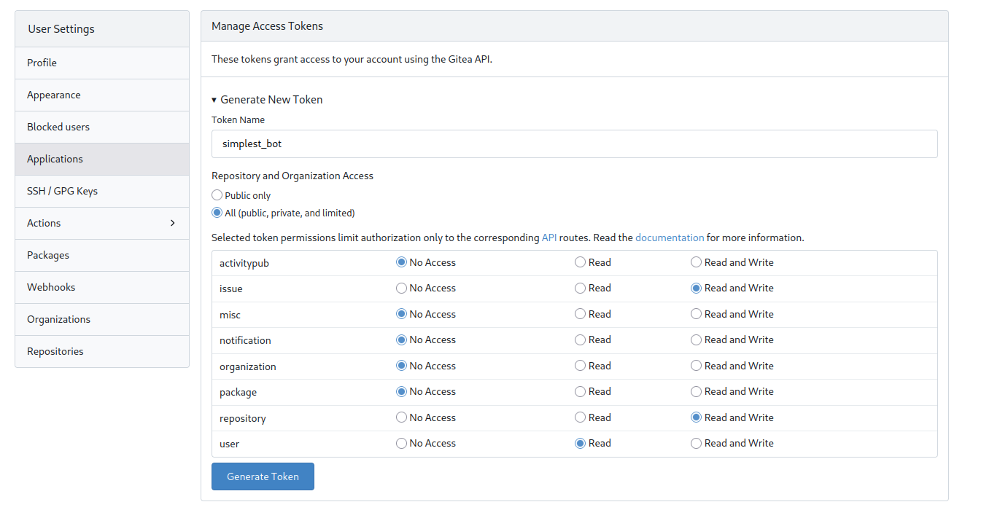

# Creating bot account

Steps to create a dedicated bot account for internal Gitea (https://src.suse.de):

1. Create a new IDP/UCS user account [here](https://idp-portal.suse.com/univention/self-service/#page=profiledata)

    -   You can use <your-username>+<bot-name>@suse.com  for the email account.
    - But the bot user name must not contain "+" !!! The user name must be valid alpha or numeric or dash(-_) or dot characters!

2. This new account need an employee flag to have permission to be able to access the internal instance. 

    - Refer to [this document](https://confluence.suse.com/spaces/devops/pages/1533346174/How+to+request+IBS+access) about how to obtain the proper flag. 
    - This is done via SD ticket
    
3. Testing the account 
    - Once SD ticket is done then open anonymous browser window (you don't want to mess with your primary login) and try to login to https://src.suse.de with new account
    - You can now assign new account as "Collaborator" and then "Reviewer" on any PRs

4. Create access Gitea token for your bot
    - Go to "Your new bot account" / User Settings / Applications 
    - Create an access token for your bot with following permissions
    