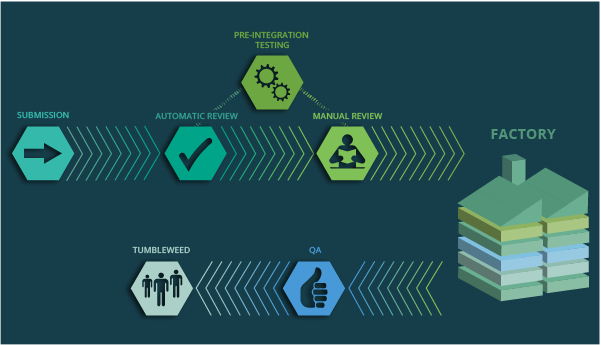

# Distribution development and maintenance processes

The tools in this repository are designed mainly to assist in the processes of developing and
maintaining the Linux distributions of the (open)SUSE ecosystem. As such, to understand the role of
some tools it's important to have some degree of knowledge about such processes. This document
provides an overview with links for those who want to dive deeper in any particular topic.

The reader is expected to be familiar with the most basic [Open Build
Service (OBS)](https://openbuildservice.org/) concepts, such as packages or projects. If that's not the
case, please check the [Conceptual
Overview section](https://openbuildservice.org/help/manuals/obs-user-guide/art.obs.bg.html#sec.obsbg.concept) in the OBS user guide.

## Tumbleweed development

The Factory project is the rolling development codebase for openSUSE Tumbleweed.

Factory is built in its own project `openSUSE:Factory`, on the [openSUSE
instance](https://build.opensuse.org) of the Open Build Service. That project is a huge repository
of packages. Initial development of those packages, however, does not happen directly in
`openSUSE:Factory` but in so called devel projects. Each devel project has its own set of processes,
rules and communication channels that fits them best. But when it comes to integration of all those
pieces into Factory (to be then released as part of the next snapshot of openSUSE Tumbleweed),
everything follows the development process described [in this
section](https://en.opensuse.org/openSUSE:Factory_development_model) of the openSUSE wiki.

The tools contained in this repository come into play when someone creates a submit request from a
devel project to Factory. The journey of such request is represented in [this
diagram](https://stephan.kulow.org/mermaid.html). The review process is highly automated thanks to
the usage of tools like `factory-auto`, `legal-auto` or `repo-checker`.

Apart from the "traditional" review process, requests must follow the staging workflow in order to
be accepted into Factory. Such workflow is also made possible thanks to the tools included in this
repository, specially the [staging plugin for
osc](https://github.com/openSUSE/openSUSE-release-tools/blob/master/docs/staging.asciidoc).
Currently, the plugin relies on the OBS capabilities to implement [staging
workflows](https://github.com/openSUSE/open-build-service/wiki/Staging-Workflow), extending and
adapting them to the (open)SUSE use case.

# SUSE Linux Enterprise Development

The SUSE Linux Enterprise distribution is built in a SUSE-internal instance of OBS usually referred
as IBS. There is a project in that build service for each SLE release (eg. `SUSE:SLE-15:GA` for
SLE-15 or `SUSE:SLE-15-SP1:GA` for its first service pack).

Major releases as SLE-15 are considered as base products and have to build everything from scratch and
bootstrap binaries. Each service pack, such as SLE-15-SP1 or SLE-15-SP2, represents a new product that
is carved out of the life cycle of the codebase of its base product.

IBS can fetch packages from an earlier version of a service pack (or from the base product), thereby
maintaining full compatibility while requiring to maintain a reduced number of package version
across all service packs. This is called inheritance of packages. The project associated to a
service pack in IBS only contains those packages that need to be fixed or updated, inheriting the
rest from a previous service pack or from the base product.

Apart from that particularity, the development process of both the base products and its service
packs is pretty similar to the Tumbleweed one. For each new version of a package, a submit request is
created in IBS and that request goes through a review process and through the staging workflow. But
the set of tools used during the review process is not identical. On one hand, some tools may be
common but configured in a slightly different way. On the other hand, there are some extra tools
like the [Origin Manager](./origin-manager.md) to verify aspects that are not relevant for
Tumbleweed.

The following [SUSE-internal
document](https://confluence.suse.com/display/projectmanagement/Product+Handbook) offers all kind of
details about the processes involved in the development of SLE and all its associated products.

## openSUSE Leap Development

Starting with version 15.3, openSUSE Leap shares its base binary packages with the corresponding
version of SUSE Enterprise Linux (SLE-15-SP3 in the case of Leap 15.3). This development process
based on binaries generated in IBS was already tested as a proof of concept for Leap 15.2 under the
codename Jump.

TODO: document better this process and its relationships with the tools in this repository. For the
time being, check [this section](https://en.opensuse.org/openSUSE:Packaging_for_Leap) of the
openSUSE wiki and also [this description](https://en.opensuse.org/openSUSE:Leap_development_process)
of the old (prior to Leap 15.3) development process.

## Maintenance Process for openSUSE Leap and SLE

Having a defined process to release maintenance updates is crucial for distributions like SLE and
openSUSE Leap, which release a new version approximately once per year instead of getting a constant
stream of updated packages like it happens in openSUSE Tumbleweed. Those maintenance updates are the
only mechanism to fix severe bugs and security issues between two releases. 

As explained in the corresponding section, during the development of a product, packages are checked
into its GA project (eg. `SUSE:SLE-15-SP2:GA` is the corresponding project for SUSE Linux Enterprise
15 SP2). Once the distribution is considered as ready to be released, the GA project is locked and a
corresponding update project (like `SUSE:SLE-15-SP2:Update`) is introduced to receive packages that
will be released as updates.

Maintenance requests (similar to the submit requests created during development) are created to
release an update of a package for an already released distribution. Those requests also go through
a review process assisted by some of the tools in this repository. Similar to the staging workflow,
in which one or more packages are verified in a staging project before their submit requests can be
accepted into the GA project, the packages from one or several maintenance request are verified in a
so-called incident project before accepting them in the corresponding update project.

Despite the similarities between the concept of maintenance incidents and the staging workflow, the
former is implemented by separate mechanisms not based on any of the tools in this repository.

[This section](https://en.opensuse.org/openSUSE:Maintenance_update_process) of the openSUSE wiki
offers a high-level view of the maintenance update process for openSUSE Leap. This other
SUSE-internal document offers a [more technical
view](https://confluence.suse.com/display/maintenancecoordination/Maintenance+Internals) on the
equivalent process for SLE.

Last but not least, Quarterly Update is a service SUSE provides to its customers to recreate
existing installation media including the latest released updates. Quarterly Updates are usually
released every 3 months after FCS release. The whole process is documented in this [internal wiki
page](https://confluence.suse.com/display/maintenancecoordination/Quarterly+Update+Process).

## Additional links

- Repository used to coordinate the [openSUSE Leap release
  process](https://github.com/openSUSE/openSUSE-release-process)
- Some SUSE-internal information about [botmaster.suse.de](http://botmaster.suse.de), the
  [GOCD](https://www.gocd.org) instance executing the OBS and IBS bots:
  - [Announcement](https://confluence.suse.com/pages/viewpage.action?pageId=200966145)
  - [Overview](https://confluence.suse.com/display/projectmanagement/Botmaster+Documentation)
  - [Help for the SLE Release Managers](https://confluence.suse.com/display/projectmanagement/Botmaster)
- [How the mainteinance process if coordinated internally at
SUSE](https://confluence.suse.com/pages/viewpage.action?spaceKey=maintenance&title=Maintenance+Process)
- More SUSE-internal information about the [maintenance
  process](https://confluence.suse.com/pages/viewpage.action?spaceKey=maintenancecoordination&title=Shift+Left+Maintenance+Process+-+Implementation)
